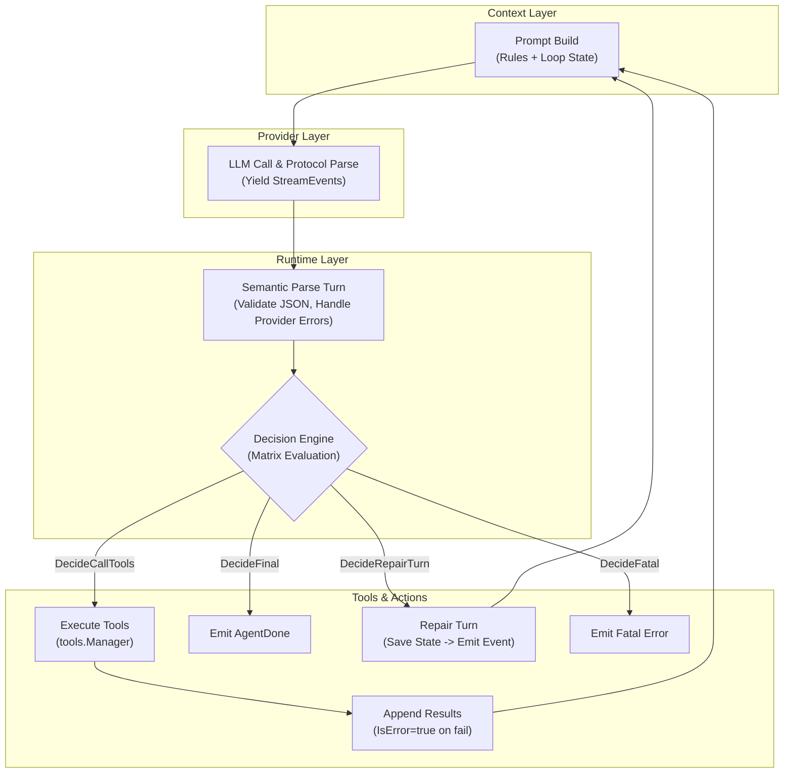

# NeoCode ReAct 循环内核 v2 重构设计文档

## 1. 现状以及问题

**当前现状（基线）**

目前我们 `neo-code` 的核心交互循环位于 `internal/runtime/runtime.go`。它的核心逻辑是一个过程式循环：

- **循环控制薄弱：** 当前主要依赖 `assistant.ToolCalls` 长度分流，`finish_reason` 仅记录不驱动流程。
- **数据流截断：** `Provider` 的流式事件仅暴露 `text_delta` 和 `tool_call_start`，`tool_call` 的参数增量在底层被合并，直到最终响应才返回。
- **上下文静态：** `Context` 由 `defaultSystemPrompt` + `Project Rules` + `System State` 组成，对于当前循环经历了什么，大模型是“失忆”的。

**面临的核心问题**

1. **工具调用异常处理粗糙：** JSON/参数错误会显著降低成功率并触发错误回合，虽有回灌机制，但在复杂场景下部分流转会过早终止或空转。
2. **容易陷入死循环：** 缺乏全局状态控制，如果模型陷入“调用错误工具->报错->继续调用错误工具”的循环，系统难以智能熔断。
3. **用户体验受限：** 当前 `runtime` 仅把 provider 流事件映射为 `EventAgentChunk` / `EventToolCallThinking`，并没有把参数增量透出为 `runtime event`。TUI 层无法实现“打字机”式的参数展示效果。
4. **架构职责未完全解耦：** 缺少独立的 runtime 语义校验层，流程流转依然直接依赖 Provider 统一封装后的 `provider.Message/ToolCall` 对象进行分支判断，防御性不足。

## 2. 重构的地方以及解决的问题

本次 v2 重构的**核心思想是“解耦”与“状态化”**。我们将把扁平的循环升级为一个**带有容错和自我修复能力的强类型状态机**。保持 `TUI`、`Provider` 和 `Tools` 的边界稳定，将复杂度收敛在 `Runtime` 和 `Context` 内。

**主要重构点与解决的问题：**

- **重构 Runtime (引入状态机与决策引擎)：** 解决空转和缺乏语义防御的问题。确立累积流事件为“单一事实来源”，实现结构化解析和有限次的自纠错（Repair Turn）。
- **重构 Context (动态状态注入)：** 解决模型“单轮失忆”问题。将运行时状态（当前轮次、上轮结果、无进展次数）注入 Prompt，赋予大模型元认知能力。
- **扩展 Provider & Runtime 事件契约：** 解决 TUI 体验受限问题。定义新的增量事件类型与包含严格语义约束的 Payload。

## 3. 现状与重构的比对表

| **维度**     | **现状 (As-Is)**                                       | **重构目标 (To-Be / ReAct v2)**                              |
| ------------ | ------------------------------------------------------ | ------------------------------------------------------------ |
| **循环控制** | 扁平循环，依赖 `assistant.ToolCalls` 长度判断分支      | 闭环状态机，由 `LoopState` 和 `DecisionEngine` 驱动          |
| **状态记忆** | 无。大模型不知道当前在第几轮循环                       | 有。Prompt 尾部动态注入 `ReAct Loop State`                   |
| **流式数据** | 仅 `text_delta` 和 `tool_call_start`                   | Provider 补充 `tool_call_delta` 等事件，Runtime 透出对应新事件 |
| **解析机制** | 依赖统一后的 `Message/ToolCall` 判定，无 JSON 校验层   | 两层解析：Provider协议层解析 + Runtime语义层解析 (JSON校验等) |
| **异常处理** | 工具返回错误会包装为 `tool` 消息回灌，严重错漏可能终止 | 引入 `Repair Turn` 追加 Runtime 生成的普通 user 消息（可见、可追溯）；引入阈值彻底熔断 |
| **结束判定** | `ToolCalls` 长度为 0 或达到最大循环次数                | 基于决策矩阵：严密覆盖所有分支并设绝对兜底规则               |

## 4. 整体架构设计与数据流向详细说明

### 数据流向脉络与单一事实来源 (Single Source of Truth)

**⚠️ 核心原则：** 在 v2 架构中，`Parser` 和 `DecisionEngine` 的**单一事实来源是 Provider 透出的累积 Stream Events**。`ChatResponse.Message` 仅作为底层通信日志或兼容结构记录，**绝对禁止**直接读取 `ChatResponse.Message` 来参与分支决策，以防实现分叉。

**异常流收尾兜底与错误映射契约：**

若 `provider.Chat()` 在执行过程中直接返回错误，Runtime 主调度层必须将此错误移交给 `Parser` 处理。`Parser` 在将其转化为 `ParseIssue{Code: "provider_error"}` 时，其 `Retryable` 属性**必须严格沿用现有 Provider 底层错误定义的重试语义**（与现有 `runtime` 重试逻辑对齐），不可自行发挥，确保不同厂商的降级策略统一。

### 架构流程图

代码段




## 5. 具体实现设计 (数据结构与核心逻辑)

### Runtime 内部状态对象 (`internal/runtime/state.go`)

Go


```
type LoopState struct {
    Turn               int
    MaxTurns           int
    NoProgressCount    int
    LastDecision       DecisionAction
    LastFinishReason   string
    LastToolResults    []ToolResultSummary
}

type ParsedAssistantTurn struct {
    Content        string
    ToolCalls      []provider.ToolCall
    FinishReason   string
    ParseIssues    []ParseIssue
    StreamClosed   bool
}

type ParseIssue struct {
    Code      string // invalid_tool_json, incomplete_stream, empty_turn, provider_error
    Message   string
    Retryable bool
}

type DecisionAction string
const (
    DecideCallTools  DecisionAction = "call_tools"
    DecideFinal      DecisionAction = "final_answer"
    DecideRepairTurn DecisionAction = "repair_turn"
    DecideFatal      DecisionAction = "fatal"
)
```

### 决策引擎判定矩阵 (`internal/runtime/decision.go`)

判定严格按上表从上到下的顺序评估。**ParseIssues 的判定优先级绝对高于 ToolCalls 与 Content。**

| **优先级** | **条件**                                                     | **判定动作 (DecisionAction)** | **后续处理逻辑**                                             |
| ---------- | ------------------------------------------------------------ | ----------------------------- | ------------------------------------------------------------ |
| 1          | 存在 `ParseIssues` && `Retryable == false`                   | `DecideFatal`                 | 不可恢复错误，终止循环，抛出 EventError。                    |
| 2          | 存在 `ParseIssues` && `Retryable == true` && `NoProgressCount < 2` | `DecideRepairTurn`            | 触发自纠错 (生成可见 user 消息)，NoProgressCount + 1。       |
| 3          | `len(ToolCalls) > 0` (且 `len(ParseIssues) == 0`)            | `DecideCallTools`             | 走 tools.Manager，结果回灌，NoProgressCount 清零。           |
| **4**      | **len(ParseIssues) == 0 && len(ToolCalls) == 0 && Content != ""** | `DecideFinal`                 | 视为得出结论，发送 EventAgentDone 并终止循环。               |
| 5          | 连续 `NoProgressCount >= 2` 或不可恢复的流错误               | `DecideFatal`                 | 触发防死循环熔断，抛出 EventError 给 TUI。                   |
| 6(兜底)    | 默认情况 (未命中以上所有条件)                                | `DecideFatal`                 | 拦截未知状态（如 Parser 未产生明确 issue的异常空白），严防穿透空转。 |

### Repair Turn 逻辑与时序机制

当触发 `DecideRepairTurn` 时，为防止 UI 幻读，系统必须**严格遵守“先落库，再发事件”**的时序：

1. **生成消息：** Runtime 构建一条 `role=user` 的内部消息：*"上轮输出未形成可执行结果，请仅输出有效答案或合法 tool call JSON 参数..."*。
2. **状态落库 (Save)：** 立即调用 session 持久化逻辑（如 `session.Save()`），将会话历史及此消息物理写入存储。
3. **派发事件 (Emit)：** 确认落库成功后，再派发 `EventUserMessage` 事件。使该自我纠错过程在 TUI 侧“可见且可追溯”。
4. **进入下轮：** 携带更新后的 LoopState 重新进入 Prompt Build。

## 6. 格式规范与所需支持

### 1. Provider 层的数据契约扩展 (`internal/provider/provider.go`)

Go


```
const (
    StreamEventToolCallDelta StreamEventType = "tool_call_delta"
    StreamEventMessageDone   StreamEventType = "message_done"
)

type StreamEvent struct {
    Type               StreamEventType 
    // ... 现有字段 ...
    ToolArgumentsDelta string          
    ToolCallIndex      int             
    FinishReason       string          
}
```

**message_done 绝对闭环契约（重要）：**

- **成功路径必达规则：** Provider 在 `Chat` 成功返回（`nil error`）之前，**必须且仅能触发一次** `StreamEventMessageDone` 事件。若 Parser 发现 `Chat` 正常返回但流事件未累积到 `message_done`，必须视为底层协议违规，强行产出 `ParseIssue{Code: "incomplete_stream", Retryable: true}`。
- **异常兜底规则：** 若 Provider 发生异常断开（流读取报错返回），亦需走 Parser 错误收尾逻辑（转化为 `provider_error` 或 `incomplete_stream`）。

### 2. Runtime 事件透出支持 (`internal/runtime/events.go`)

新增透出事件，明确载荷字段的具体语义与边界，确保 TUI 并发渲染稳定无歧义：

Go


```
const (
    EventToolArgumentsDelta EventType = "tool_arguments_delta"
)

type EventToolArgumentsDeltaPayload struct {
    Turn          int    // 约束：1-based (从 1 开始的当前回合序数)，用于 TUI 隔离不同回合的卡片
    ToolCallIndex int    // 约束：0-based 的数组索引。若 Provider 协议无法提供准确索引，应传 -1 (未知)
    ToolCallID    string // 约束：厂商返回的唯一ID。若厂商协议无明确 ID (或在流初始未下发)，允许为空字符串 ("")
    Delta         string // JSON 增量片段
}
```

## 7. Context 层状态段格式规范

`ReAct Loop State` 必须以固定格式放置在 Prompt 的最末尾。

Plaintext


```
## ReAct Loop State
turn: {Turn}/{MaxTurns}
last_decision: {LastDecision}
last_finish_reason: {LastFinishReason}
no_progress_count: {NoProgressCount}
recent_tool_results:
- tool_name: {name} | status: {ok/error} | summary: {short_summary}
```

## 8. 最小验收测试用例清单 (DoD)

开发提测与 Code Review 阶段，必须确保以下 5 个核心边界用例通过：

1. **优先级冲突测试 (Priority Conflict):**
   - **场景:** Provider 流正常结束，输出了一段文本，同时包含了 `ToolCalls > 0`，但 Tool Arguments 的 JSON 结构非法（缺少右括号）。
   - **预期行为:** Parser 必须产出 `invalid_tool_json`，决策矩阵绝不允许落入 `DecideCallTools`（即便存在 ToolCalls）或 `DecideFinal`（即便存在文本），必须精准命中 `DecideRepairTurn`。
2. **成功路径流截断测试 (Missing message_done):**
   - **场景:** 模拟 Provider 正常返回 `nil error`，但在流发送过程中静默吃掉了 `message_done` 事件。
   - **预期行为:** Parser 识别到契约违规，必须将本轮解析产出为 `incomplete_stream`，禁止当作完整数据执行工具或结束。
3. **Repair Turn 时序一致性测试 (Save → Emit Sequence):**
   - **场景:** 触发 `DecideRepairTurn` 逻辑。Mock 持久化层（`session.Save()`）使其返回写入失败（Error）。
   - **预期行为:** 主循环捕获持久化错误并转为 Fatal 退出的同时，**绝对不应**向上游触发 `EventUserMessage` 事件，避免 UI 呈现幻读消息。
4. **空白回复兜底测试 (Empty Turn Fallback):**
   - **场景:** Provider 正常结束并触发了 `message_done`，但累积的数据既没有 `Content` 文本，也没有任何 `ToolCalls`。
   - **预期行为:** Parser 显式标记 `ParseIssue{Code: "empty_turn", Retryable: true}`。决策矩阵由 Repair 接管。
5. **死循环物理熔断测试 (Max Progress Count Reached):**
   - **场景:** 强制让模型连续输出非法 JSON，触发 `DecideRepairTurn`。
   - **预期行为:** 第一次和第二次失败能够正常追加 User 提示纠错。当第 3 次依然产出可重试的 `ParseIssue` 时，因 `NoProgressCount >= 2`，必须无情熔断落入 `DecideFatal`，终止循环。